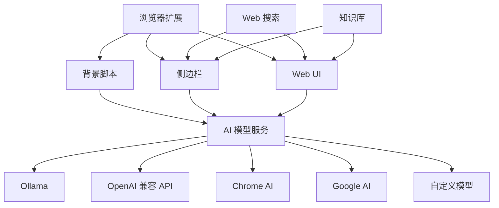
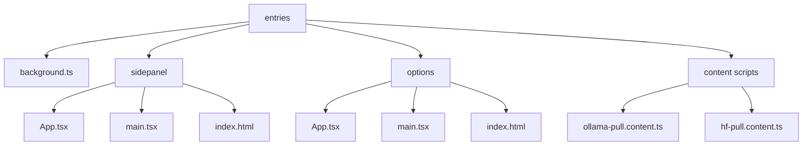
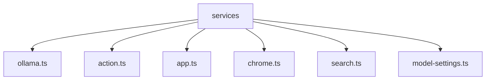
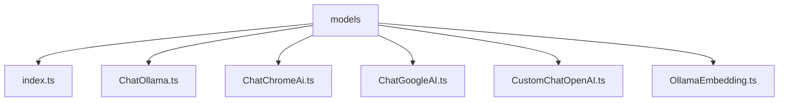
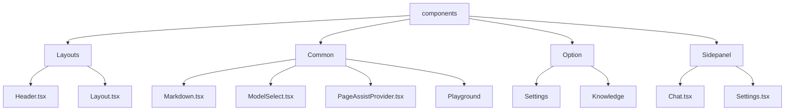
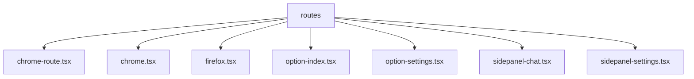
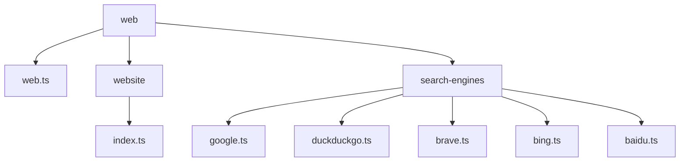
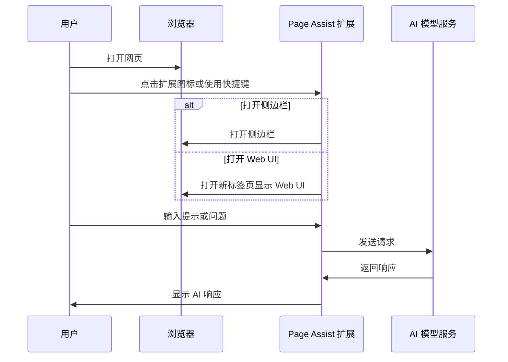
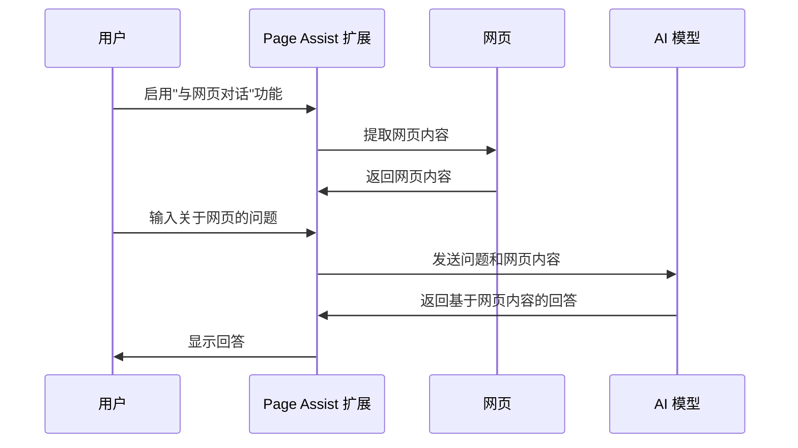
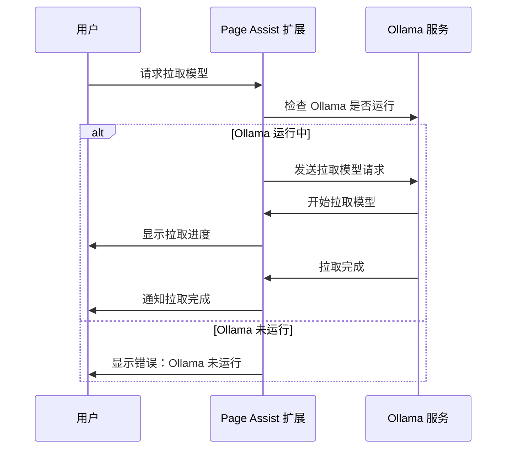

# Page Assist 架构文档

## 项目目的

Page Assist 是一个浏览器扩展，旨在为用户提供一个与本地 AI 模型交互的界面。它允许用户在浏览网页时直接使用 AI 模型进行对话、总结、翻译等操作，无需离开当前页面。主要功能包括：

- **侧边栏（Sidebar）**：可以在任何网页上打开的侧边栏，允许用户与 AI 模型交互并查看结果
- **Web UI**：类似 ChatGPT 网站的界面，允许用户与 AI 模型进行更全面的交互
- **网页对话（Chat With Webpage）**：用户可以与当前网页内容进行对话，询问关于内容的问题
- **知识库（Knowledge Base）**：支持用户上传自己的数据，与自己的数据进行对话

项目支持多种 AI 模型提供商，包括：
- Ollama（本地 AI 模型）
- OpenAI 兼容的 API 端点（如 LM Studio、llamafile 等）
- Chrome AI（如 Gemini Nano）
- Google AI
- 自定义模型

## 架构设计

Page Assist 采用了模块化的架构设计，主要分为以下几个部分：

### 核心组件

1. **浏览器扩展**：基于 WXT 框架构建，支持 Chrome、Firefox 和 Edge 浏览器
2. **背景脚本**：处理扩展的核心功能，如模型拉取、上下文菜单、消息传递等
3. **侧边栏**：提供在任何网页上与 AI 模型交互的界面
4. **Web UI**：提供类似 ChatGPT 的全功能界面
5. **AI 模型服务**：连接不同的 AI 模型提供商
6. **Web 搜索**：支持多种搜索引擎，为 AI 提供实时信息
7. **知识库**：允许用户上传和查询自己的数据

## 模块设计

### 1. 入口模块（Entries）

负责定义扩展的不同入口点，包括背景脚本、侧边栏、选项页面等。

### 2. 服务模块（Services）

提供与 AI 模型和其他功能的交互服务。

### 3. 模型模块（Models）

定义与不同 AI 模型提供商交互的接口。

### 4. 组件模块（Components）

定义 UI 组件，包括布局、对话界面、设置界面等。

### 5. 路由模块（Routes）

定义应用的路由结构。

### 6. Web 模块

处理网页内容提取和搜索功能。

## 工作流程

### 主要工作流程

### 与网页内容交互流程

### 模型拉取流程

## 技术栈

- **前端框架**：React
- **UI 库**：Ant Design
- **状态管理**：React Query
- **构建工具**：WXT (Web Extension Tools)
- **AI 集成**：Langchain
- **语言**：TypeScript
- **样式**：Tailwind CSS

## 扩展点

Page Assist 设计了多个扩展点，允许添加新的功能和集成：

1. **AI 模型提供商**：可以添加新的 AI 模型提供商
2. **搜索引擎**：可以添加新的搜索引擎
3. **提示模板**：可以添加新的提示模板
4. **UI 主题**：支持明暗主题切换
5. **语言支持**：支持多语言界面
